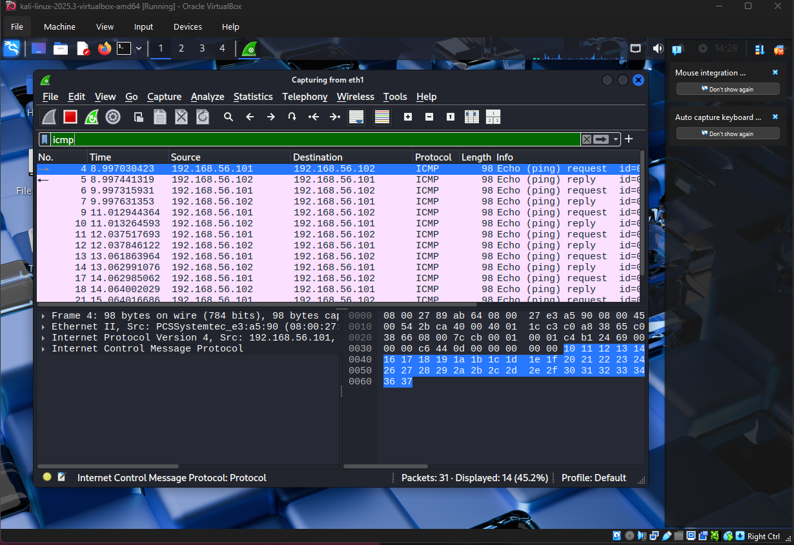
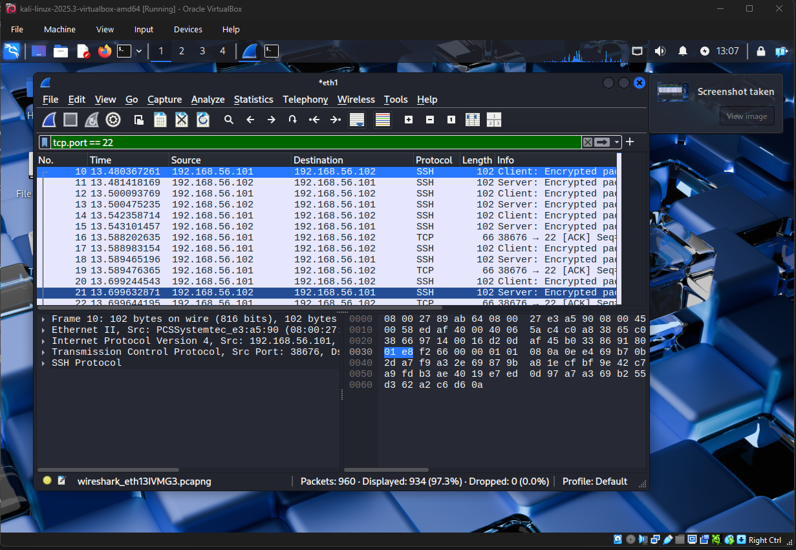
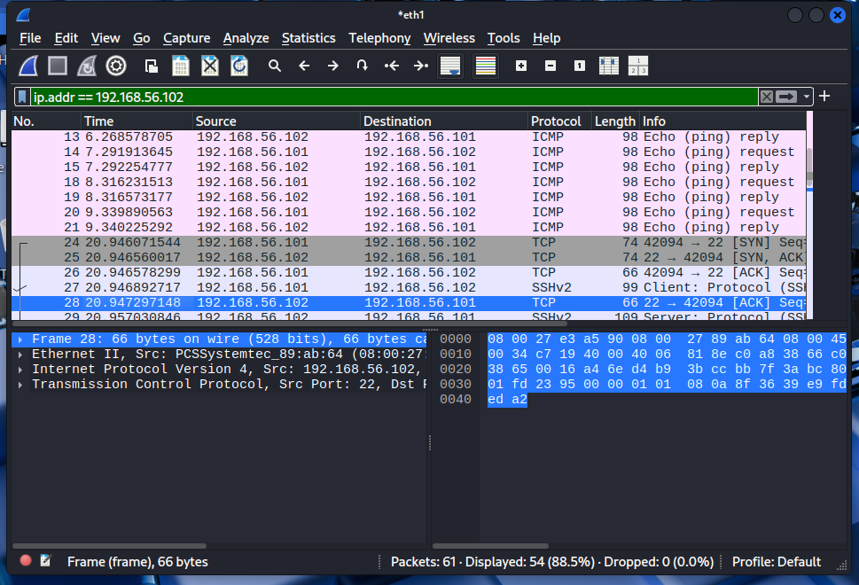

##Wireshark Practice - 2025-11-24

## Lab Setup

- Kali VM (attacker / client): `192.168.56.101` (eth - host-only)
- Ubuntu VM (server): `192.168.56.102` (host-only)
- Wireshark running on **Kali**, interface **eth1**

## What I Did 

1. Started a capture on Kali's 'eth1' (host-only) interface.
2. From Kali ran:
  - `ping -c 4 192.168.56.102`
  - `ssh user@192.168.56.102` and logged into Ubuntu.
3. Stoped the capture after the ping and SSH session.

## Filters I Used

- `icmp` - to see ping traffic.
- `tcp.port == 22` - to see SSH traffic.
- `ip.addr == 192.168.56.102` - to show all traffic to/from the Ubuntu VM.

## What I Saw

- ICMP echo request and echo reply packets between `192.168.56.101` (Kali) and `192.168.56.102` (Ubuntu).
- SSH traffic on TCP port 22:
  - Encrypted packets (no visible command content, only metadata like source/dest IP and ports).
- Confirmed both VM's can communicate over the host-only network.

## Lessons Learned

- Difference between **capture filters** and **display filters**:
  - If I set a capture filter like `tcp port 22`, ICMP packets are never recorded.
  - Display filters (`icmp`, `tcp.port == 22`) only show protocols that are actually in the capture.
- What ping (ICMP) and SSH (TCP/22) traffic look like on the wire.

## Screenshots

### SSH traffic filtered by tcp.port == 22

### SSH traffic filtered by ip.addr

