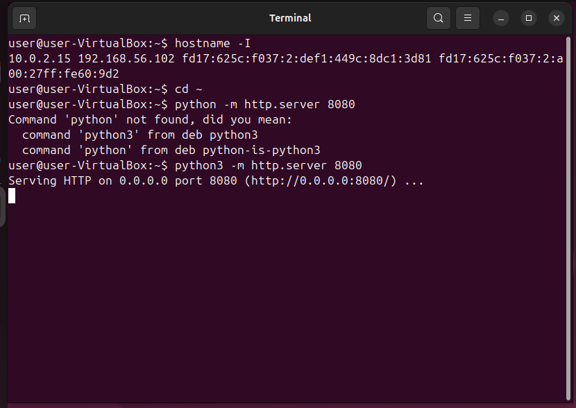
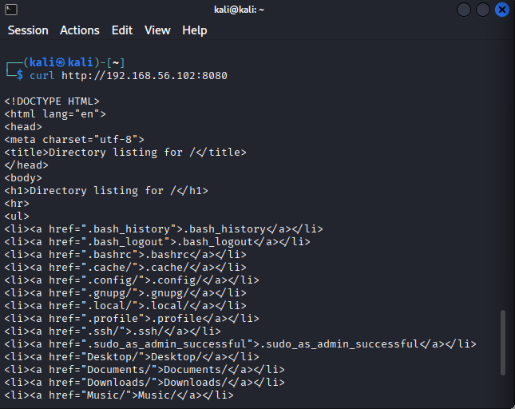
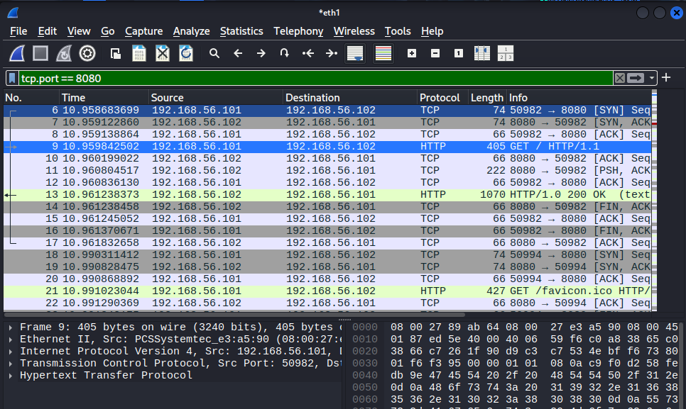
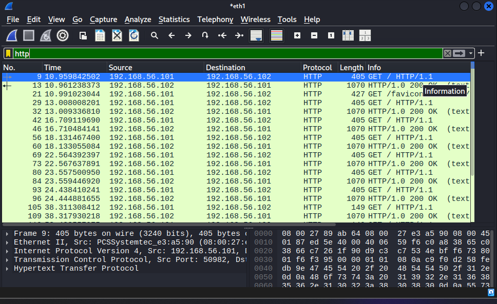
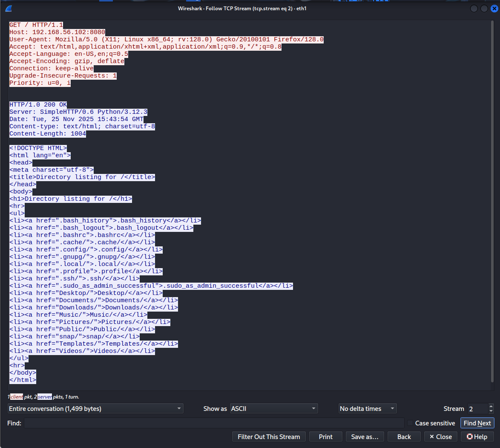

# Wireshark Practice – 2025-11-25 (HTTP)

## Lab Setup

- **Kali VM (client):** `192.168.56.101`
- **Ubuntu VM (web server):** `192.168.56.102`
- **Network:** VirtualBox host-only network `192.168.56.0/24`
- **Capture location:** Wireshark on **Kali**, interface `eth1` (host-only)
- **Web server on Ubuntu:**
  ```bash
  hostname -I        # shows 10.0.2.15 192.168.56.102 ...
  cd ~
  python3 -m http.server 8080
- **Output:**
 - `Serving HTTP on 0.0.0.0 port 8080 (http://0.0.0.0:8080/) ...`

## What I Did 

1. Started the web server on Ubuntu using:
   ```bash
   python3 -m http.server 8080
2. On Kali, Started Wireshark and began a capture on interface `eth1`.
  -  (the host-only interface with IP `192.168.56.101`)
3. From Kali generated HTTP traffic to the Ubuntu server.
  - In Firefox:
    - Browsed to `http://192.168.56.102:8080`
    - Refreshed the page multiple times.
4. Stopped capturing after several HTTP requests and the responses were recorded.
5. Applied Wireshark filters and used **Follow → TCP Stream** to inspect HTTP traffic.

## Filters I Used 

- `ip.addr == 192.168.56.102` - all traffic to and from the Ubuntu web server.
- `tcp.port == 8080` - HTTP traffic to the python web server.
- `http` - only HTTP protocol packets.

## What I Saw

- HTTP traffic between:
  - Source: `192.168.56.101` (Kali)
  - Destination: `192.168.56.102` (Ubuntu)
- Multiple HTTP **GET** requests from Kali to Ubuntu on port `8080`.
- HTTP **200 OK** responses from the Python server
- With `http` as a display filter, Wireshark decoded:
  - Request line: `GET / HTTP/1.1`
  - Headers like: `Host`, `User-Agent`, `Accept`
- Using **Follow → TCP Stream** on one HTTP packet showed:
  - The full HTTP request from the browser.
  - The full HTML directory listing returned by `python3 -m http.server`
    (list of files in the Ubuntu user's home directory)

## Lessons Learned 

- How to start a simple web server with:
  ```bash
  python3 -m http.server 8080```
- HTTP runs on top of TCP and can use non-standard ports like `8080` instead of `80`
- Wireshark display filters:
  - `tcp.port == 8080` is useful when you know the port but Wireshark doesn't decode as HTTP yet.
  - `http` is useful once Wireshark has recognized the protocol.
- **Follow TCP Stream** is very powerful for:
  - Reconstructing an entire HTTP conversation (request and response).
  - Seeing what data was sent over the wire (headers and body).

## Screenshots

### Python HTTP server on Ubuntu



### curl from Kali to the Ubuntu web server



### HTTP traffic filtered by tcp.port == 8080



### HTTP traffic filtered by http



### Follow TCP Stream – full HTTP request/response



