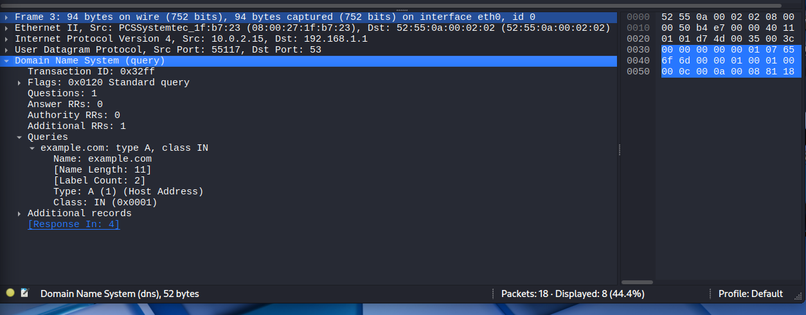
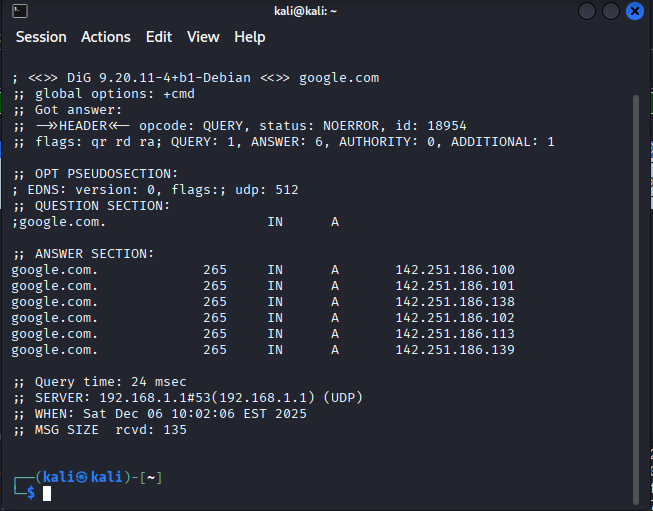
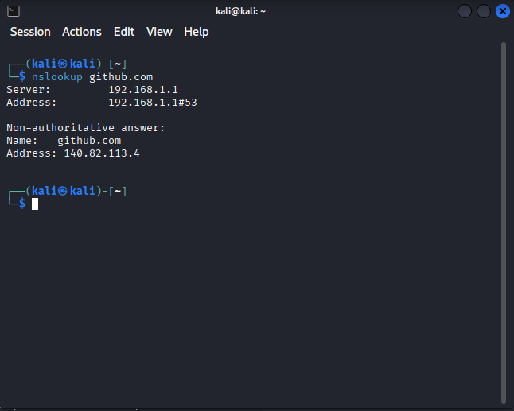

# Wireshark Practice – 2025-12-06 (DNS)

## Lab Setup

- **Kali VM (client):**
  - NAT IP: `10.0.2.15` (interface: `eth0`)
- **DNS server:**
  - `192.168.1.1` (seen in `dig` / `nslookup` output)
- **Network:**
  - VirtualBox **NAT** used for internet access.
- **Capture location:**
  - Wireshark on **Kali** interface `eth0` (NAT).
- **Goal:**
  - Capture and analyze DNS queries and responses from Kali to the DNS server.
 
## What I Did

1. **Identified the NAT interface on Kali**
   - `ip a`
   - Confirmed that `eth0` had IP `10.0.2.15` (NAT).
2. **Started a capture on the NAT interface**
   - Opened Wireshark
   - Selected interface `eth0`
   - Started a capture
3. **Genearted DNS traffic from Kali**
   In the terminal i ran:
     - `dig google.com`
     - `nslookup github.com`
   - `dig google.com` showed multiple A records for `google.com`
   - Both commands showed that the DNS server in use was `192.16.1.1` on port `53`
4. **Experimented with display filters in Wireshark**
   - Showed all DNS traffic:
     - `dns`
   - Showed DNS by port:
     - `udp.port == 53`
   - Focused on a specific query:
     - `dns.qry.name == "example.com"`
5. **Inspected a DNS query and its details**
   - With the `udp.port == 53` or `dns` filter active. I selected a packet with info similat to:
     - `Standard query 0x32ff A example.com`
   - In the left pane I expanded **Domain Name System (query) and saw:
     - Transaction ID: 0x32ff
     - Flags: 0x0120 (standard query)
     - Questions: `1`
     - Answer RRs: `0`
     - Queries section:
       - Name: example.com
       - Type: A (Host Address)
       - Class: IN (0x0001)
     - IP/UDP layers showed:
       - Source IP: `10.0.2.15` (Kali)
       - Destination IP: `192.168.1.1` (DNS server)
       - Source port: a random high UDP port `55117`
       - Destination port: `53`

## Filters I Used

- `dns` - all DNS protocol packets
- `udp.port == 53` - all UDP traffic on port 53 (DNS)
- `dns.qry.name == "example.com"` - DNS queries for a specific domain

## Example DNS Query I Inspected

- Kali (`10.0.2.15`) sent a DNS query from a random UDP source port `55117` to my DNS server `192.168.1.1` on UDP port `53`.
- In the **Domain Name System (query)** section:
  - Transaction ID: `0x32ff`
  - Flags: `0x0120` (standard query)
  - Questions: `1`
  - Query name: `example.com`
  - Query type: `A` (IPv4 host address)
  - Query class: `IN` (internet)
- Wireshark linked the matching response via `[Response In: 4]` where the DNS server replied with an A record for example.com with an IPv4 address and TTL.
  - Kali asked: “What is the IPv4 address for `example.com`?”
  - The DNS server at `192.168.1.1` answered with the IP address in the Answer section of the response.

## What I Saw

- DNS queries from Kali (`10.0.2.15`) to the DNS server `192.168.1.1` on UDP port `53`.
- For each domain (`google.com`, `github.com`, `example.com`):
  - A **Standard query** followed by a **Standard query response**.
- `dig google.com` produced multiple A records in the answer section (several `142.251.186.x` addresses).
- `nslookup github.com` returned `140.82.113.4` as the IPv4 address for `github.com`.
- In the DNS responses in Wireshark:
  - The Answer section included:
    - Record type `A` (IPv4)
    - The resolved IP address
    - TTL (how long the client can cache the answer)

## Lessons Learned

- DNS typically runs over **UDP port 53** which I can filter with:
  - `udp.port == 53` or `dns`.
- The field `dns.qry.name` is useful to filter by specific domains being queried.
- A typical DNS exchange looks like:
  - Client → DNS server: query (QNAME, QTYPE, QCLASS)
  - DNS server → client: response with answers (A/AAAA/CNAME records).
- From a SOC perspective:
  - DNS logs can reveal suspicious domains used by malware or C2 traffic.
  - Watching which IPs are returned for certain domains can help with threat hunting.

### DNS traffic in Wireshark

## Screenshots

### DNS traffic in Wireshark

### DNS query details

### dig output for google.com

### nslookup output for github.com

